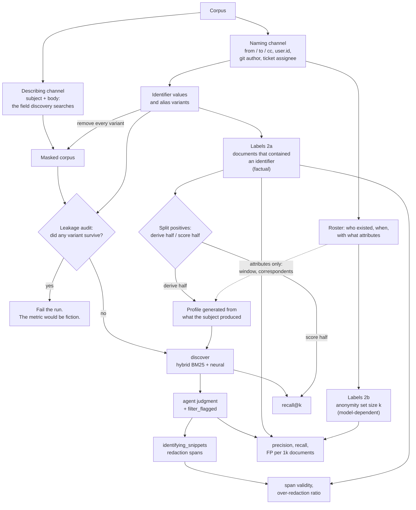

# Evaluating indirect identification

How to build ground truth for the hard half of an erasure request, and what the
resulting numbers do and do not tell you.

> **Status:** stages one and two are implemented for Enron: `roster` builds the
> naming-channel roster and reports coverage, `mask-corpus` builds the masked
> index and the label set, `audit-mask` re-runs the leakage gate, `subjects`
> ranks candidates the corpus can score, and `score-discovery` and
> `score-judgment` score the three pipeline stages. The demo corpus in
> `scripts/seed_demo.py` still carries hand-built labels.
>
> Everything below marked **Measured** is a figure from a real run against the
> full 517,394-message corpus, not an estimate.

## Why this needs a document

Validating the direct pass is trivial. `discover-direct` finds documents
containing a literal identifier, and anyone can confirm a hit by searching the
text for the same string. The answer key writes itself.

The indirect pass has no such key. When a document says *"the sole senior
frontend engineer on Checkout who resigned in March"*, deciding whether that
identifies a particular person is not a property of the document. It depends on
how many people fit the description, which the document does not say and the
index does not contain. Producing a key by hand means an assessor reading every
document and making that call, which does not reproduce, does not scale, and on
a real corpus means performing the identification the tool exists to remediate.

The method below avoids assessors by taking labels from data the corpus already
holds.

## The core idea

Most real corpora have two channels:

- a **naming channel** that identifies people in structured form (an email
  header, a `user.id` field, a git author, a ticket assignee);
- a **describing channel** of unstructured text where people are talked about.

Discovery searches the describing channel. So the naming channel is available as
a label source without contaminating the search. Label from the names, evaluate
on the descriptions.

This is what makes the approach portable. The specific fields differ everywhere,
the structure does not.

## How it fits together



Read it as two paths out of one corpus that reconverge only at the bottom. The
searchable text the pipeline sees is the masked describing channel and nothing
else. The naming channel produces the labels, the mask, and the roster, and it
reaches the pipeline as the generated profile, which stands in for the
description a real erasure request would supply.

The profile is the one place the label side touches the query side, so it is
where honesty has to be enforced explicitly. Roster attributes alone do not
retrieve anything (step 4), so the profile is built from the content of the
subject's own documents. That means splitting the positives: one half derives
the profile, the other half is scored, and no document does both jobs. Recall is
reported over the score half only. Without that split the query would be built
from the documents it is measured against, and the number would be meaningless.

The audit is a gate rather than a warning: if one alias survives masking, the
document is trivially retrievable and every number below it is meaningless.

## The method

### 1. Identify the naming channel

Find the fields that identify people and confirm they are outside the field
discovery searches (`--text-field`, default `message`). If the two overlap, the
evaluation is circular and nothing below is valid.

Check what each candidate field actually holds rather than what its name
suggests. **Measured:** reading Enron's `From`/`To`/`Cc`, which hold bare
addresses, gave display names for 1.7% of addresses and the roster reported a
corpus that could not support the later stages. The readable names and Exchange
logins are in `X-From`/`X-To`/`X-cc`, and reading those instead gave 90% on the
same data. A naming channel that yields almost no names is more likely to be the
wrong field than a corpus without names.

### 2. Derive labels

Two schemes, usable together.

**2a. Held-out identifier (mention recovery).** For a chosen subject, the
positives are every document whose text contains one of their identifiers. Mask
those identifiers, and evaluate on what remains. The label is a fact about the
corpus: the string was there before you removed it.

This measures whether residual context alone re-links a document to the person,
which is the capability the skill claims.

*Mask broadly, label narrowly.* One variant list cannot do both jobs. Masking
must remove anything that might refer to the subject, because a survivor makes
the document trivially retrievable, and over-masking only costs context.
Labelling must use only variants no one else in the population produces,
because a shared name is not evidence about any particular person. Decide which
is which from the roster rather than by category: a variant is discriminative
when no other roster entry generates it. **Measured:** seven people in this
corpus are called Harry, and labelling one of them on the full variant list made
92% of their positives documents about somebody else.

*A mention is not a description.* Scheme 2a labels every document containing the
string, and in email most of those are recipient lists and forwarded header
blocks. Masking a name out of a forty-person distribution list yields a document
about nobody, which no profile can retrieve and no judgment can flag. Classify
each mention as running prose or list context, and count only the prose ones
when deciding whether a subject can be scored at all. **Measured:** on a 34,656
message sample, one subject's 67 positives held 48 pure list mentions and 19
descriptive ones, which collapsed to 7 distinct documents after near-duplicates.
Retrieval against that label set returned 1 of 67 at k=200, which is the correct
answer to a question not worth asking.

**2b. Anonymity set size (roster).** Given a population of people active in the
document's time window, and the markers a document asserts, count how many
population members satisfy all of them:

| Anonymity set size | Reading |
| :--- | :--- |
| 1 | identifies the subject |
| 2 to ~5 | singles out a small group, arguably still personal data |
| large | describes a role, not a person |

This is GDPR Recital 26's uniqueness test expressed as a count, and it produces
graded labels on a principled basis rather than an assessor's scale. It also
calibrates the `precision_mode` thresholds, which are otherwise chosen by feel.

Unlike 2a, this scheme is model-dependent, not factual. See
[Limitations](#limitations).

**Choosing a subject.** Volume is the obvious criterion and the wrong one. It
counts appearances in headers, which are exactly the list mentions that cannot
be scored. Rank candidates by distinct descriptive mentions instead, collapsing
near-duplicates, since a corpus that repeats one announcement forty times offers
one document's worth of evidence.

Screen out subjects whose surname is an ordinary word before masking anything.
Compare how often the surname appears against how often the full name does: a
large ratio means the string belongs to the language rather than the person.
**Measured:** `love` outnumbers `Phillip Love` 94 to 1, `dean` 40 to 1, and
`cash` 7 to 1, while genuinely rare surnames sit near 1. Masking on a
high-ratio surname deletes an English word from the entire corpus and labels
thousands of unrelated documents as being about one person.

### 3. Audit the holdout, and fail loudly

If masking is incomplete the metric is fiction, because a single surviving
mention makes the document trivially retrievable. Treat this as a gate that
fails the run, not a warning. Check for:

- **name variants**: full name, surname alone, given name alone, initials, login
  or alias, every email address the person used;
- **quoted reply chains**, where a name masked in one document reappears inside
  another document's quoted block;
- **document ids**, which frequently embed a name. `seed_enron.py:189` yields
  `f"{custodian}/{folder}/{num}"`, so the custodian surname is in every id;
- **signature blocks**, where a direct phone number or extension identifies as
  well as a name does;
- **container names**: a folder, mailbox, or index named after the subject;
- **the mask token itself**, which marks every positive and nothing else.
  **Measured:** `[MASKED]` appeared in 743 of 517,394 documents, essentially the
  711 that were masked, so searching for it returns the answer key. It was also
  the single strongest distinctive term in the positive set.

Masking therefore leaves nothing behind: the variant is removed and the
surrounding whitespace closed up, rather than replaced with a marker. Diluting a
marker into negatives is the obvious alternative and does not work at these
proportions. With 711 positives in 517,394 documents, marking ten thousand
negatives still leaves the marker 48 times more predictive than the base rate,
and only marking essentially every document makes it uninformative. Removal also
matches what is being simulated, a document written without the name. The audit
enforces this by failing whenever a configured marker appears in fewer documents
than a multiple of the positive count.

The last two are a judgment call. An unmasked phone number is arguably a true
positive for identification rather than leakage. Decide which effect you are
measuring and record the decision.

The audit can only look for the variants it is given, so it must also fail on an
alias set too thin to audit against. A subject with no name variant passes every
check above while the corpus still prints their name on every page, which is
worse than no gate because it certifies the corpus as scorable. **Measured:** a
subject with six address-derived variants and no display name passed a clean
audit while 89 documents still contained their full name verbatim.

For the same reason the audit should not rely solely on the masking pattern: a
boundary rule that skips a name on the way in skips it on the way back out. A
second, looser check that ignores word boundaries catches that class. It
over-reports by construction, so report it rather than fail on it. **Measured:**
an `@` in the pattern's right-hand boundary left surnames intact wherever
forwarded mail wrapped an address across table cells as
`<Lynn.Blair@e| | |nron.com>`.

### 4. Construct queries mechanically

The profile is an input to the pipeline, and writing one by hand per subject
measures the prose as much as the system. Generate several wordings per subject
and report the spread across them. A large spread is itself a finding: it says
the tool's output depends heavily on how the request is phrased, which users
need to know. **Measured:** three wordings of the same subject varied threefold
in recall@50, from 1.9% to 5.6%.

*Describe the activity, not the org chart.* Structured roster attributes are the
obvious source and they do not work. Who someone emailed and when does not
retrieve documents they wrote. **Measured:** a profile built from a subject's
active window and top correspondents returned 0 of 451 positives at k=500, while
a profile describing what they produced returned 12% to 15%. Worse, the roster
pointed the wrong way entirely: header co-occurrence is dominated by
distribution lists, so the top correspondents placed this subject on a trading
desk when their own documents were all pulp and paper.

*Derive the profile from held-out documents of the subject's own.* Split the
positives, extract distinctive terms from one half, score recall on the other.
This mirrors a real erasure request, where the data subject describes what they
did rather than who they sat near, and it stays honest because the scored
documents never contribute to the query. Check that the two halves are retrieved
at similar rates: if the derive half comes back far more often, the profile has
memorised specifics rather than described a role.

### 5. Run the pipeline

`discover` (and `discover-direct` where identifiers are supplied), then the
Phase 2 evaluation, then `plan`. Nothing is written to the cluster, so scoring
reads `plan` output rather than cluster state.

The evaluating agent must not see the labels. The demo corpus enforces this:
document ids are opaque digests rather than names like `sub-1`, and `seed-demo`
writes its answer key to `gdpr-eval/demo-ground-truth.json` instead of printing
it. Apply the same discipline to any corpus you build.

### 6. Score three stages separately

The pipeline has three stages that fail independently, and a single end-to-end
number hides which one broke.

| Stage | Output | Metric |
| :--- | :--- | :--- |
| `discover` | candidate list | recall@k against the labeled positives |
| agent + `filter_flagged` | flagged set | precision, recall, false positives per 1000 documents |
| `identifying_snippets` | redaction spans | span validity (verbatim substring of the document), over-redaction ratio |

Retrieval recall bounds everything downstream: a document that never reaches the
candidate list cannot be recovered by any amount of judgment quality. Span
validity matters because a snippet that is not a verbatim substring causes the
Painless script to silently no-op, so a document can be correctly flagged and
still not redacted.

Run a BM25-only ablation beside the hybrid query every time. **Measured:** on
identical keywords, BM25 alone reached 20.5% recall@500 against hybrid's 13.0%,
and the two were within noise below k=100. Hybrid's score fusion displaced BM25
hits deeper in the ranking rather than adding to them.

Check what the neural half of the hybrid query actually sees before reading
anything into a recall figure. The local model truncates at a few hundred
word-pieces, well short of the 4000 characters `seed_enron` keeps, so k-NN
matches document openings while BM25 matches the whole text. On a corpus whose
identifying mentions sit in quoted blocks near the end, "hybrid" recall is
closer to BM25 recall than the name suggests, and an ablation against BM25-only
is the way to find out rather than assume.

Score each `precision_mode` (0.88 / 0.75 / 0.60) rather than only the default,
and break results out by category where the corpus supports it. On the demo
corpus the decoys vary one marker each (wrong team, wrong seniority, wrong
month, a different named person), so per-category results say considerably more
than an aggregate.

### 7. Report with the assumptions attached

Every number depends on a stated roster, a marker schema, a masking policy, and
a threshold. Publish those alongside the result. A reader who disagrees should
be able to attack a specific input rather than the conclusion as a whole.

## Applying it to Enron

`mail-enron` is already structured for this. `parse_member`
(`scripts/seed_enron.py:118`) indexes `from`, `to`, `cc`, `custodian`, `folder`,
and `message_id` as separate fields, while `message` holds only subject and body
(`:116`). Discovery searches `message`. The naming channel is therefore already
held out by construction.

**Naming channel:** `from`, `to`, `cc`, `custodian`.
**Describing channel:** `message`.

**Roster.** Sweeping every address across the archive reconstructs the
population: `@enron.com` addresses give internal staff, and first-and-last-seen
timestamps per address give an approximate active window. The alias variants
step 3 needs come from `X-From`/`X-To`/`X-cc`, not from `From`/`To`/`Cc`, which
hold bare addresses; the `X-` headers also carry the Exchange login as the
trailing `CN=` fragment, so logins are observed rather than guessed. They pair
positionally with the address lists, and the names must be dropped when the two
disagree on length rather than mispaired. A correspondence graph clusters into
something resembling teams. Headers carry no job titles, so attribute coverage
is partial; check what the distribution ships alongside the maildir, and public
sources such as the FERC record cover senior figures.

**Measured** on the full 517,394-message corpus: 87,479 distinct addresses, 58%
with a display name, 11% with an Exchange login. Login coverage falls as the
corpus widens, because external correspondents have no Exchange DN.

**Mention recovery.** Pick a subject by descriptive-mention density rather than
volume, take every document whose `message` contains one of their discriminative
identifiers as the positive set, mask the full variant list across the whole
text including quoted regions, and run the pipeline against the masked copy.
Recall is measured over the positives, false positives over documents about
other people. Both the masking and the labelling depend on choices made in step
2; state them with the result.

**Natural cases.** Role-reference language appears in roughly 1% of Enron
messages and usually describes a generic role or names the person elsewhere in
the same message. Where a thread describes someone in one message and names them
in the reply, the reply supplies a label for genuinely natural indirect language.
Yield is low and the work is manual, but this set is the useful complement to the
masked one, because masking manufactures a document nobody wrote.

**Ethics.** These are real people, most of them private individuals whose mail
became public because of an investigation into others. Report aggregate metrics.
Do not publish reconstructed profiles of individuals, and do not reproduce more
personal data than a finding requires.

## Applying it generically

The naming channel differs by corpus. The method does not.

| Corpus | Naming channel | Describing channel |
| :--- | :--- | :--- |
| Email archive | `From` / `To` / `Cc`, mailbox owner | subject, body |
| Application logs | `user.id`, `actor`, `principal` | free-text message |
| Git history | author, committer, co-author trailers | commit message, code comments |
| Ticketing | reporter, assignee, watchers | description, comments |
| Chat export | `user_id`, mention entities | message text |
| Incident reviews | attendee or participant list | narrative, timeline |

For the roster scheme, define an interface and write adapters rather than
hardcoding a source:

```json
{
  "id": "stable-key",
  "identifiers": ["Jun Tanaka", "j.tanaka@example.com", "EMP-4471"],
  "attributes": {"role": "...", "team": "...", "seniority": "..."},
  "active_from": "2021-06-01",
  "active_to": "2024-03-31"
}
```

An Enron adapter derives entries from headers. A customer's adapter is a CSV
export from HR, a SCIM pull from an identity provider, an on-call schedule, or
`CODEOWNERS` history. In production these systems are what actually resolve a
description like "sole on-call during incident #4091", because the organization
already records who that was.

Provide a null adapter as well. With no roster supplied, the agent estimates
uniqueness by judgment, which is the current behavior. This mirrors how
`discover` degrades to BM25 when no embedding model is deployed and reports the
degradation in `meta.mode`; the evaluation should report which mode produced its
labels for the same reason.

Corpora with no naming channel, such as scanned documents, transcripts, or prose
archives, fall outside this method. There, labels require human assessors.

## What the numbers mean

**They do not transfer.** A recall figure measured on Enron says nothing about
performance on another organization's logs, and it should never be published as
though it did. Detection is probabilistic, and this project does not make
guarantees about redaction coverage.

What the metrics support:

- **Ablations.** "Hybrid retrieval surfaces documents BM25-only misses" is a
  claim about mechanism, and mechanism claims survive a corpus change better
  than performance numbers do. This one did not survive its first test:
  **measured** on Enron, BM25 alone beat hybrid at k=500 (20.5% against 13.0%).
  One corpus does not settle it, and the plausible cause is specific to this
  data (the embedding model truncates long messages, and identifying context
  here sits late in quoted blocks). But the claim should not be repeated as
  established until a corpus is found where it holds.
- **Failure discovery.** A documented failure class, for example markers that
  all match except the time window, is actionable on any data. Negative results
  travel further than positive ones.
- **Regression detection.** Changing the judgment prompt, the embedding model,
  or the thresholds should not silently degrade results. This is the highest
  return use and requires no transfer at all.
- **Threshold calibration.** It replaces "chosen" with "chosen because they sat
  at these operating points on these corpora".

In short: internal validity, not external validity. That is true of most
benchmarks. The intended deliverable is a method a user can run against their
own corpus, plus documented failure modes, not a headline score.

## Limitations

- **Masking manufactures the indirect case.** A sentence written without a name
  would have been phrased differently from one with the name removed, so the
  masked set is a proxy. The natural cases in step 2a's complement are the check
  on this.
- **Most mentions are not descriptions.** In email the majority of documents
  containing a name contain it in a recipient list. Masking those produces
  documents about nobody, so scheme 2a's raw positive set overstates by a large
  factor how much of a corpus can be scored at all. Filter to prose mentions and
  report both counts.
- **Two people with one name are indistinguishable.** The roster merges entries
  sharing a display name, since nothing in the headers separates them, and the
  labels then cover both. No available signal catches this.
- **Anonymity-set labels are model-dependent, not facts.** The roster is a model
  of the population; extracting markers from prose is an interpretation;
  deciding whether a title satisfies a description is a judgment; and treating
  size 1 as the identification threshold is a normative choice, since Recital 26
  asks about means "reasonably likely to be used". The value is that these
  assumptions are explicit, reproducible, and individually contestable, not that
  they are objective.
- **Roster completeness biases in one direction.** Missing contractors, interns,
  or seconded staff make anonymity sets look smaller than they are, turning
  group descriptions into apparent unique identifications.
- **The population is time-scoped.** The set of people fitting a description in
  March is not the set fitting it in May.
- **Anonymity depends on whose knowledge you assume.** A set size computed
  against an internal roster is not the same as one computed against public
  information. State which.
- **Ground truth is a convention.** So is every benchmark label. The question is
  whether the convention is stated, defensible, and reproducible, not whether it
  is true.

## Related

- `knowledge/indirect-identification.md` for why hybrid retrieval is the
  mechanism under test.
- `knowledge/gdpr-reference.md` for the Recital 26 text behind the uniqueness
  criterion.
- `scripts/seed_demo.py` for the synthetic corpus and its labels.
